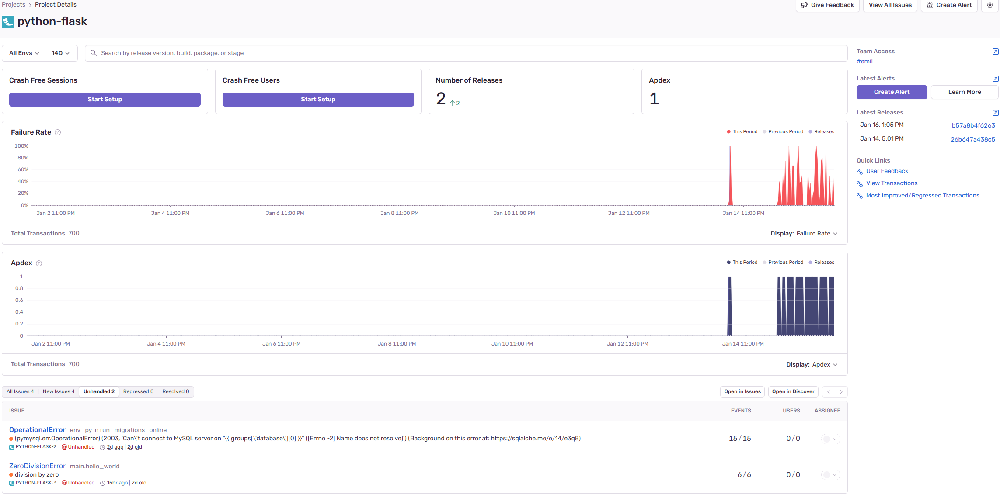

# Using Sentry to monitor Flask app health
## About Sentry
According to [Sentry's welcome website](https://sentry.io/welcome/), their tool allows you to fix broken code faster. That may actually be the case, as the tool monitors and produces detailed logs on every request and error that occurs. This eases the process of reading error logs as much of the relevant information is aggregated and presented clearly by Sentry. Each error code and whatnot is clearly linked to the process that caused the error, which makes it easier to trace the error. 
When speaking of tracing, Sentry also allows us to Trace errors between frontend and backend if it's implemented on both (that is not the case in this repo though). Another interesting feature is the ability to connect our projects current release version to Sentry and tell it to monitor the health of our release (X.Y.Z). Next time a release is made (X.Y.Y) we can start monitoring the new release and compare statistics between the releases. This gives valuable feedback on the reliability and quality of our code and project. The features offered by Sentry, such as release health monitoring and integration with DevOps, simplifies the debugging process and contributes to more efficient development and system understanding.

## Integrating Sentry into Microblog
1. Register on:`https://sentry.io/signup/`  
2. After registering you should follow Sentrys quick start guide. There you select what type of application you want monitored, for Microblog we should go with Flask.
3. After selecting Flask you will get some code to get you started. Add your version of the code below to where your app is instantiated. In the Microblog app, we insert it into `app/__init__.py` directly under `app.config.from_object(config_class)`:

    ```
    ## app.config.from_object(config_class) THIS SHOULD NOT BE COMMENTED OUT. 

    sentry_sdk.init(  
        dsn="https://XXXXXXXXXYYYYYYYYYYZZZZZZZZZ@oXXYYZZ.ingest.de.sentry.io/XXYYZZ",  
        traces_sample_rate=1.0,  
        _experiments={  
            # Automatically start the profiler when possible.
            "continuous_profiling_auto_start": True,  
        },
    )
    ```
4. To easily validate that Sentry is working properly, we can add this purposely broken route to `app/main/routes.py`:
    
    ```
    @bp.route('/broken_route', methods=['GET'])
        def broken_route():
        1/0  # raises a ZeroDivision error
        return "<p>broken_route!</p>"
    ```

5. (Microblog specific) Add the dependency name and version `sentry-sdk[flask]==1.16.0` in `requirements/prod.txt`.
6. After adding the Sentry dependency, we are ready to either deploy or start the program locally using Docker Compose. This process assumes that we build a new Docker image that includes the newly added dependency.
In our CI/CD pipeline, Sentry will automagically be pre-installed on our Azure VMs whenever a new release is created. This happens because Ansible pulls the latest (or specified) Docker image from Docker Hub, which contains all the required dependencies. When the VMs are recreated, the Docker image (version 12.0.0 or higher) ensures that Sentry and other dependencies are already included.

## Sentry's role in DevOps
While there might be tools that have a broader DevOps-related focus area than Sentry, it still finds its place as a decent tool when working towards the devops ideology. Sentry mainly focuses on monitoring and streamlining the logging details related to errors and crashes, the tool also focuses on measuring and logging performance. These are the main functionalities of Sentry. These measurements provide important data for DevOps personnel, offering tangible feedback on system health. It makes it easier to identify and combat general problems and bottlenecks. While it's mostly geared towards measuring application quality it also comes with lots of features that integrates well with a DevOps workflow. In our case, the Microblog, it would be very beneficial to connect our project to the Git-repo and let it track our releases. This gives us feedback on each individual release and makes it easier to compare.  
The image below is from the dashboard overview of the Microblog project. We can see our currently tracked releases to the far right, and get individual data for each by clicking on them. At the bottom we can se errors that were detected by Sentry, in this case we used the "/broken_route" to make sure Sentry works as intended (note that it was called hello_world when this image was taken, but the principle is the same). 


Another very useful feature offered by Sentry is the ability to set up automatic notifications on different platforms (like a Discord server) when certain events occur, like errors and crashes. This provides us with instant notifications and should lead to a faster course of action, as mentioned earlier, we will have access to the data and logs that Sentry's monitoring provided for us. The errors that arise can be traced very far if the connecting systems also run Sentry. 